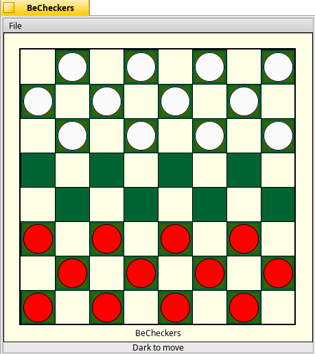

BeCheckers
=

BeCheckers is a simple checkers game developed for two players.  The game conforms to almost all ACF (American Checker Federation) rules, including:

	*	No huffs (one must complete all jumps in a jump sequence)
	*	Forced jumping
	*	Men can jump Kings (some people play men cannot jump kings)
	*	Official color scheme (Buff/Green checkerboard and Red/White checkers)
	*	All other primitive movements

